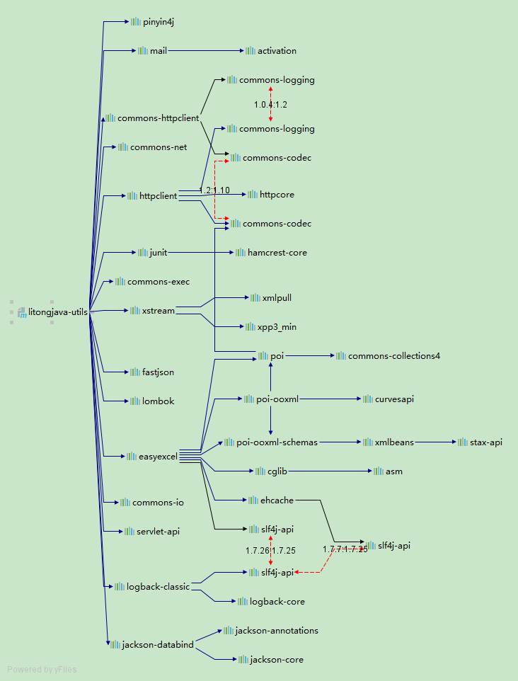

# litongjava-utils
java开发常用工具类和实体类封装
开源地址  

开源地址  
[https://github.com/litongjava/litongjava-utils](https://github.com/litongjava/litongjava-utils)  
[https://gitee.com/ppnt/litongjava-utils](https://gitee.com/ppnt/litongjava-utils)

## 依赖文件
依赖文件如

## 使用步骤

### 添加依赖
```
<dependency>
  <groupId>com.litongjava</groupId>
  <artifactId>litongjava-utils</artifactId>
  <version>1.0.6</version>
</dependency>
```
默认使用的日志是sfl4j+logback,如果日志框架冲突可以使用下面的配置排除logback
```
<dependency>
  <groupId>com.litongjava</groupId>
  <artifactId>litongjava-utils</artifactId>
  <version>1.0.6</version>
  <exclusions>
    <exclusion>
      <groupId>ch.qos.logback</groupId>
      <artifactId>logback-classic</artifactId>
    </exclusion>
  </exclusions>
</dependency>
```

### 使用工具类  
工具类都在com.litongjava.utils下,使用也和简单,那个工具列不会用可提issue,我会解答  
#### ClassPathUtils
```
URL resource = new ClassPathResource(filepath).getResource();
```
#### ClassPathResource
```
URL url = ClassPathUtils.getResource("timg.jpg");
```
#### ExcelUtils
使用ExcelUtils工具类导出Excel表格  

```
import java.util.ArrayList;
import java.util.Date;
import java.util.List;

import javax.servlet.http.HttpServletResponse;

import com.litongjava.easyexcel.pojo.Student;
import com.litongjava.utils.excel.ExcelUtils;

import org.springframework.stereotype.Controller;
import org.springframework.web.bind.annotation.RequestMapping;

@Controller
@RequestMapping("excel")
public class ExcelController {

  @RequestMapping("export")
  public void export(HttpServletResponse response) {
    // 模拟用户查询数据
    List<Student> data = new ArrayList<>();
    data.add(new Student(1, "张1", 11.1, new Date()));
    data.add(new Student(2, "张2", 11.2, new Date()));
    data.add(new Student(3, "张3", 11.3, new Date()));
    data.add(new Student(4, "张4", 11.4, new Date()));
    data.add(new Student(5, "张5", 11.5, new Date()));

    String filename = "用户管理";
    String sheetName = "用户管理";
    ExcelUtils.export(response, filename, sheetName, data, Student.class);
  }
}

```
### 工程依赖
